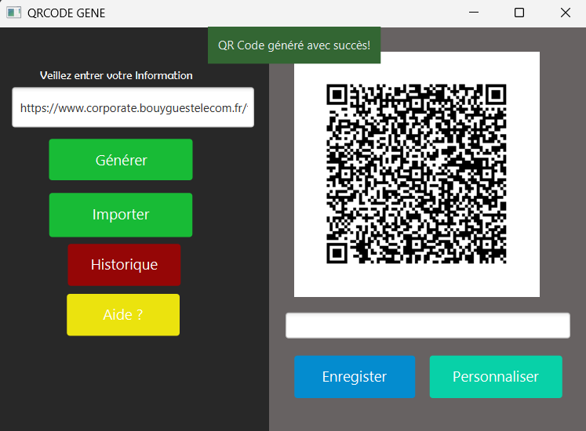
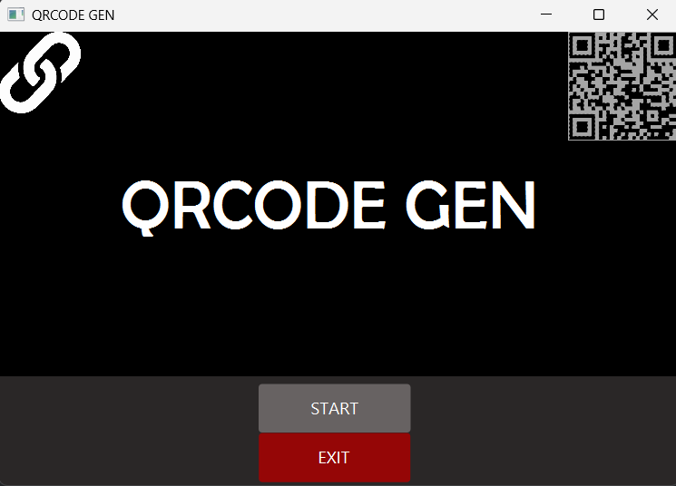

# 📱 Générateur & Décodeur de QR Code en JavaFX

Ce projet est une application de bureau réalisée en **Java avec JavaFX**, permettant de **générer** et **décoder** des QR Codes à partir d’une URL.

Il offre également des fonctionnalités de **personnalisation des couleurs** et un **historique des QR Codes générés ou décodés**.

---

## ✨ Fonctionnalités principales

- 🔗 Génération de QR Code à partir d’une **URL saisie**
- 🎨 **Personnalisation** de la couleur du QR Code (avant-plan et arrière-plan)
- 📥 **Décodage d’un QR Code** (via image importée) pour récupérer l’URL contenue
- 🕓 **Historique complet** des QR Codes générés/décodés (affichage ou enregistrement local)
- 💾 Export du QR Code en image (.png)

---

## 🛠️ Technologies utilisées

- **Java 11+**
- **JavaFX** (pour l'interface graphique)
- **ZXing (Zebra Crossing)** : bibliothèque de génération et décodage de QR Codes
- **FXML / SceneBuilder** : (si utilisé pour l’interface)
- **CSS** : pour styliser l’interface JavaFX

---

